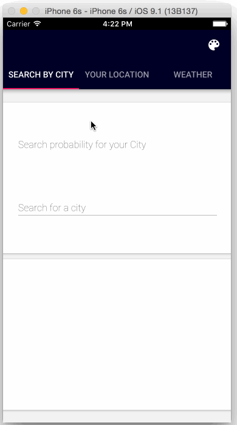
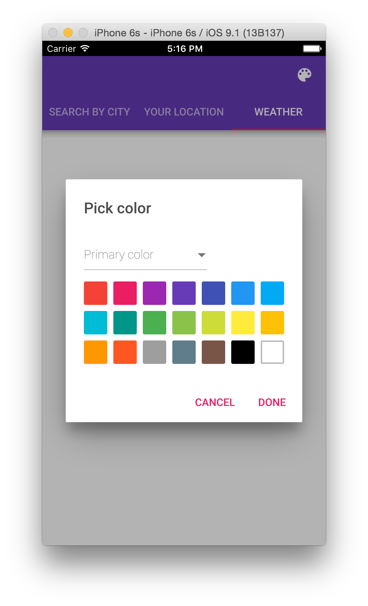
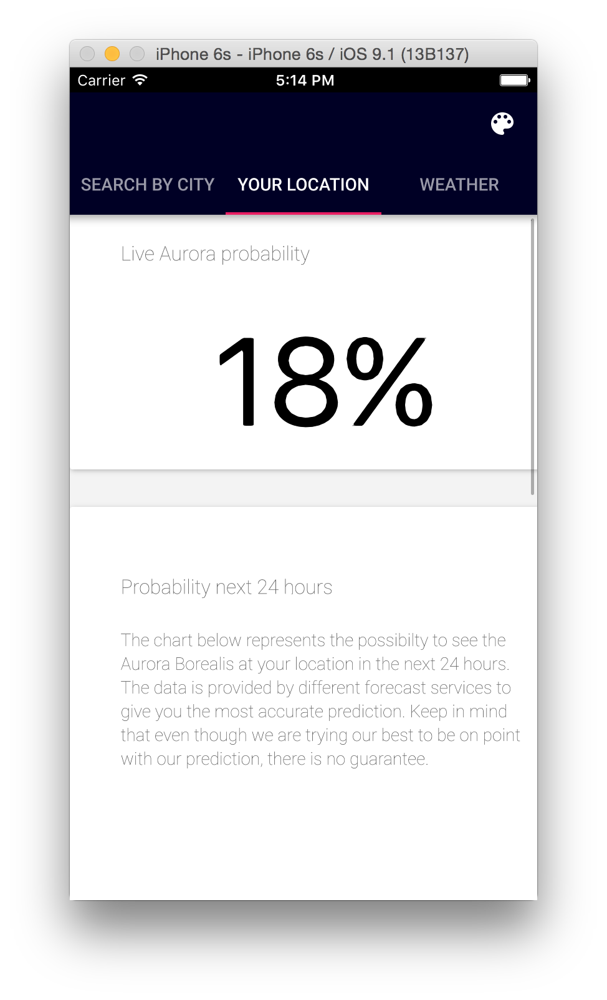
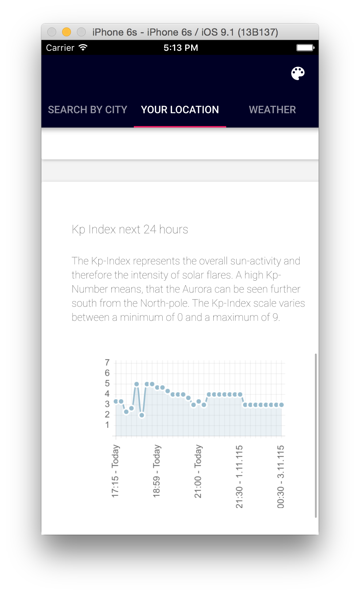
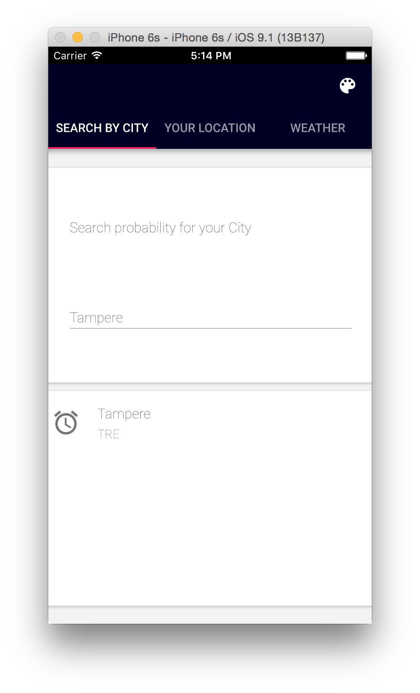
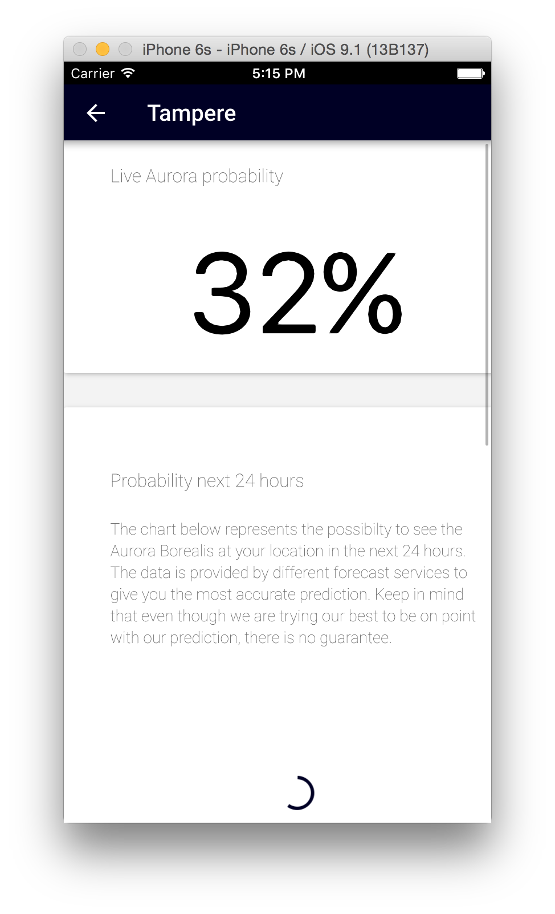
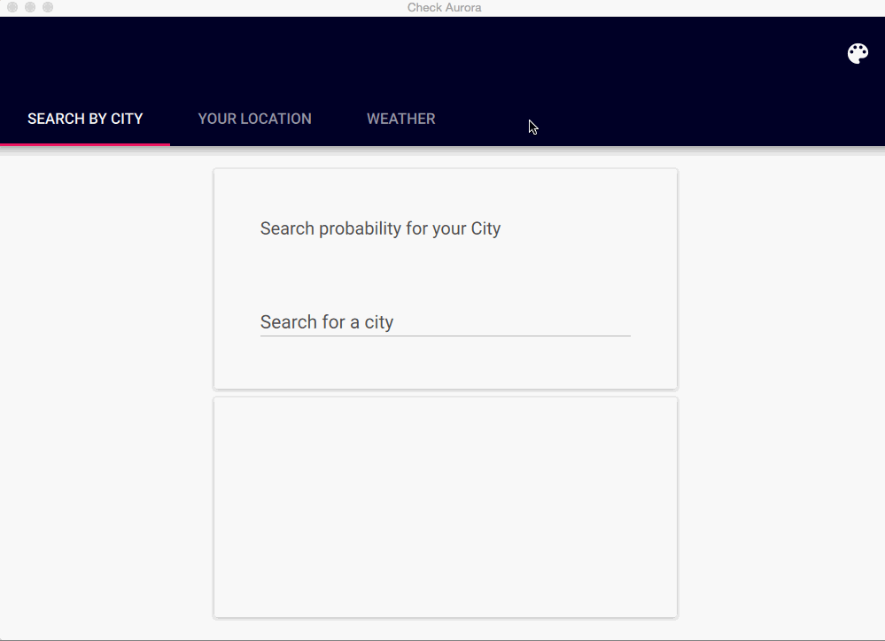
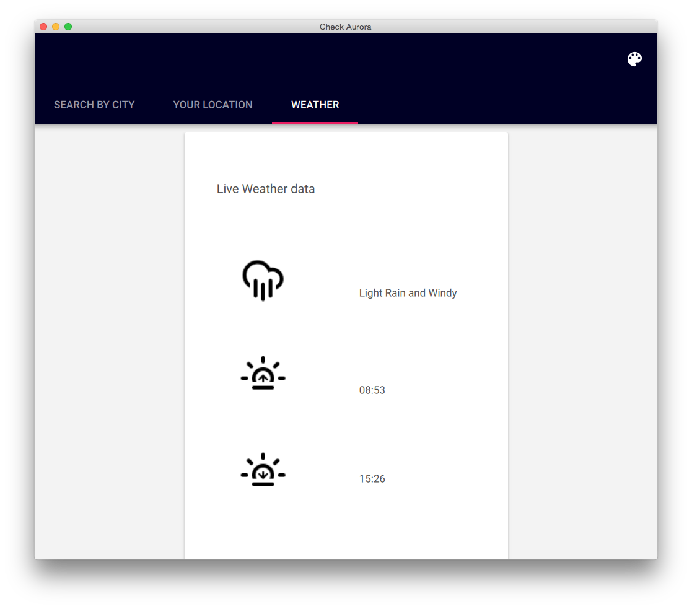
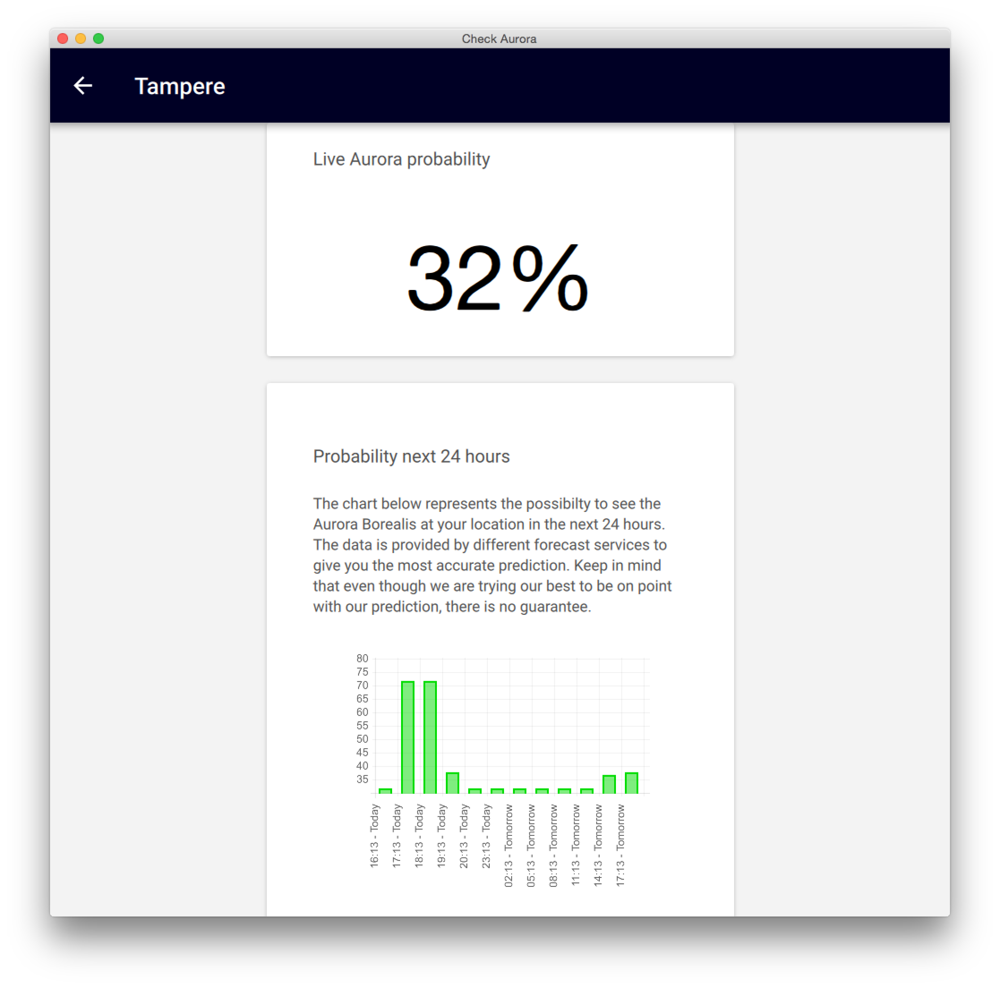

# CheckAurora-QT-Client

## Development 

Pre requirements: 

* QT5 
* [Material-QML](https://github.com/papyros/qml-material/) 
* 
Follow the instruktionsinstructions on the Material-qml repository.
To compile the software for mobile devices you need to copy the *qml/Material* and *qml/QTQucik/Contols/Styles/Material* folder to the android or ios compiler  

##Screenshots

